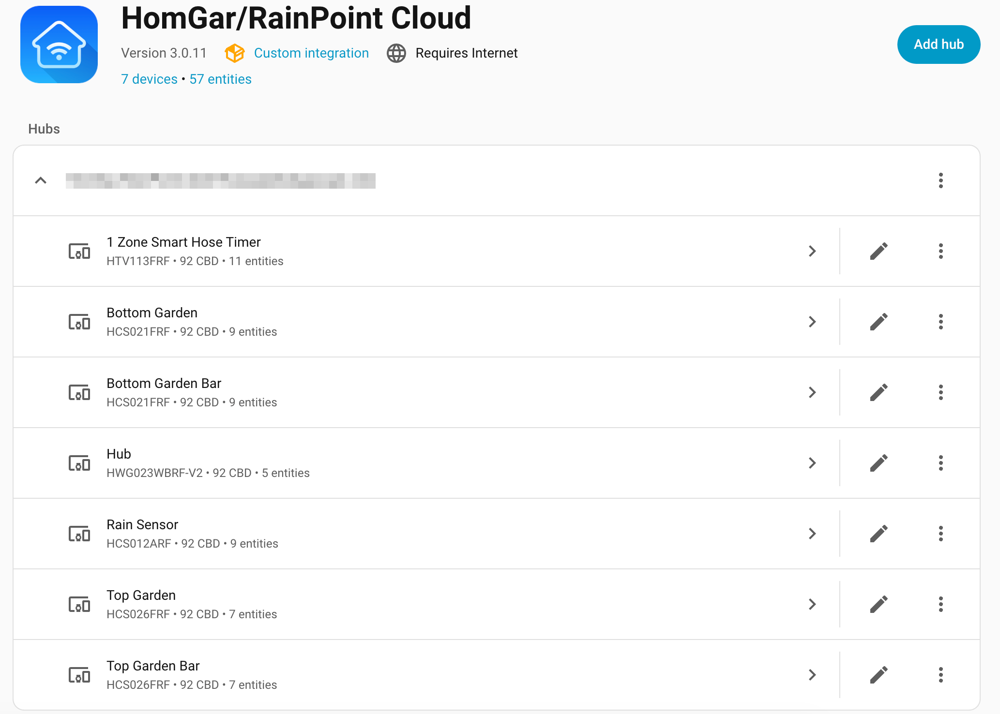
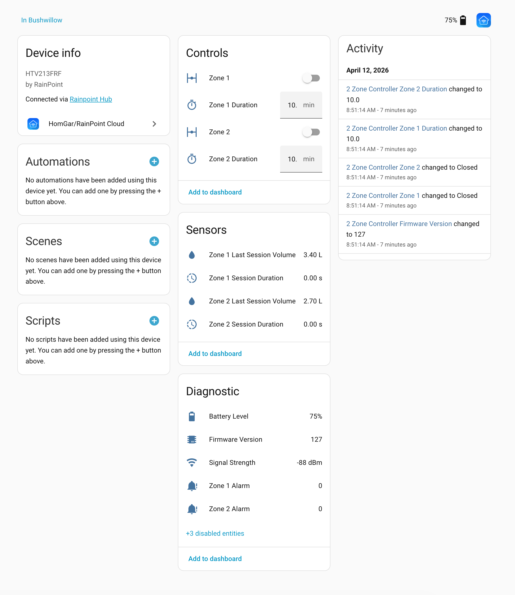
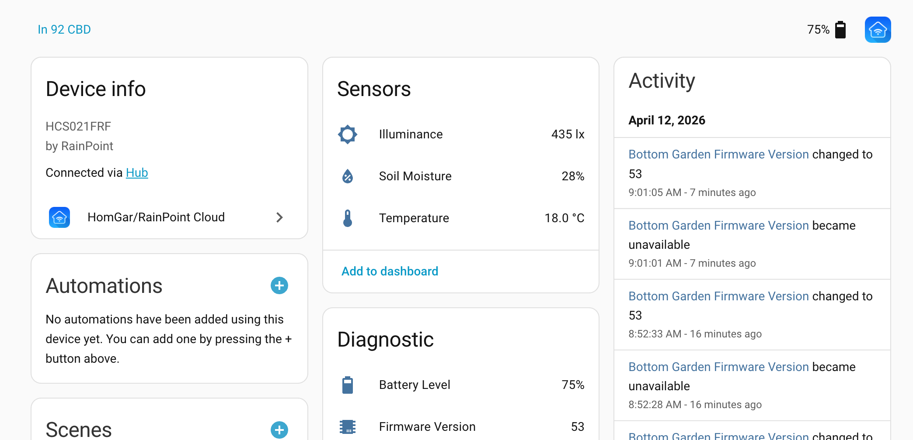
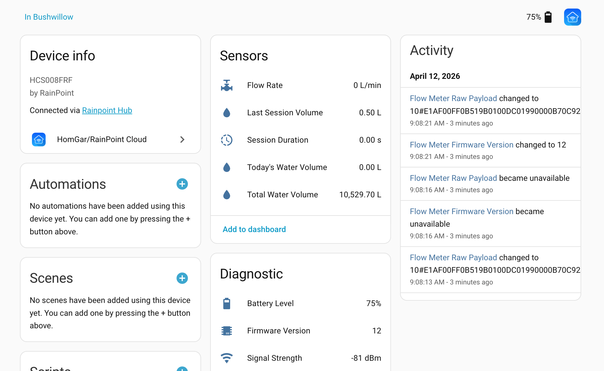
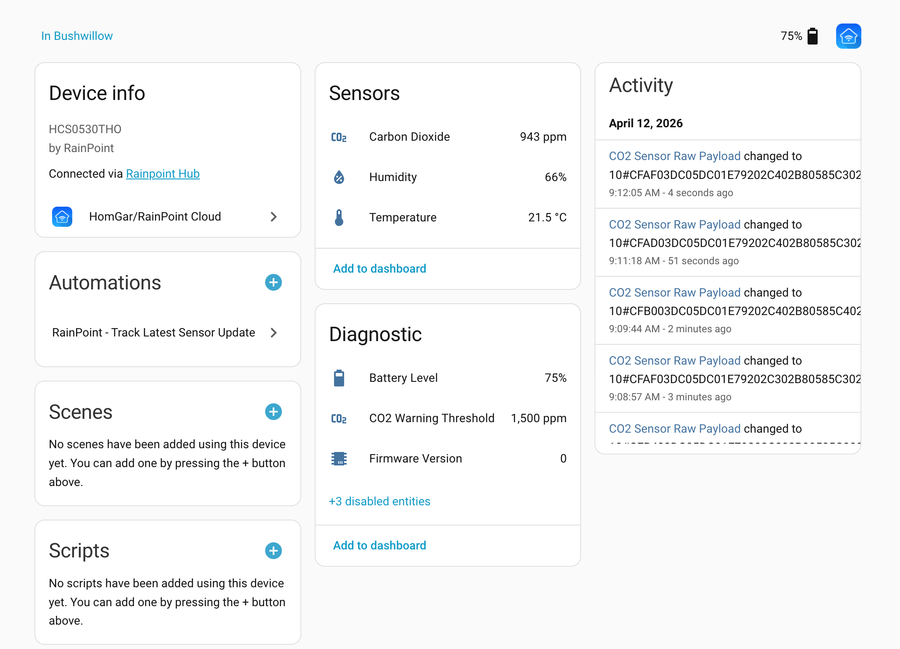
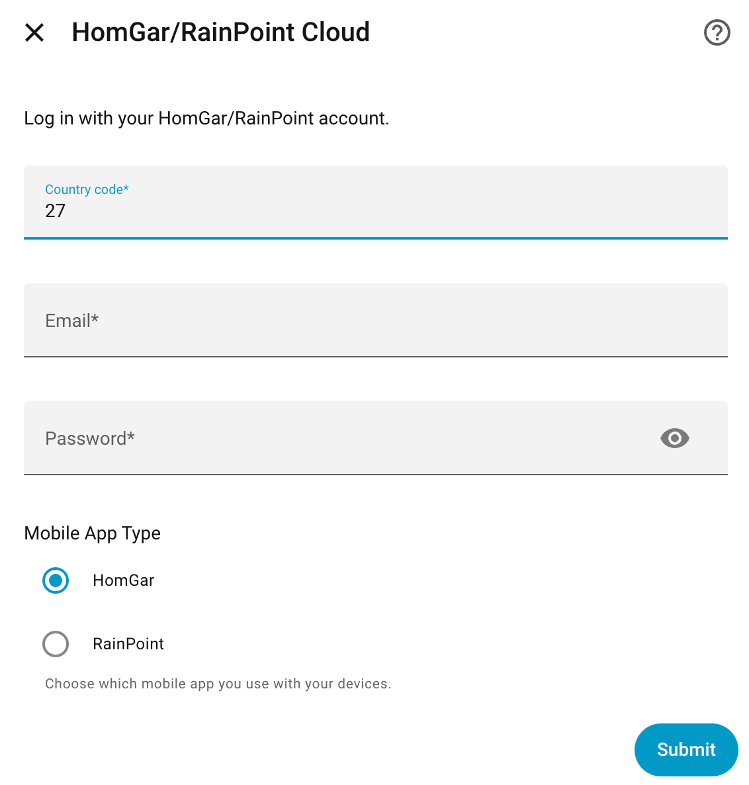

# HomGar / RainPoint Cloud Integration for Home Assistant

[](https://github.com/brettmeyerowitz/homeassistant-homgar/releases)
[](LICENSE)
[](https://github.com/hacs/integration)

Unofficial Home Assistant integration for RainPoint Smart+ devices via the HomGar/RainPoint cloud API.

---

## What you get

Control and monitor your RainPoint / HomGar irrigation devices directly from Home Assistant.

### Example entities



### Valve control



### Sensor examples





---

## Why use this?

This integration turns RainPoint hardware into a flexible, programmable irrigation system using Home Assistant.

- Build automations based on real sensor data
- Combine RainPoint devices with other brands (Sonoff, Shelly, etc.)
- Create smarter irrigation using weather, temperature, and moisture
- Monitor water usage and detect leaks

Unlike the mobile app, you are not limited to predefined schedules — you can automate anything.

---

## Example use cases & automations

### Cross‑vendor control (powerful)
Use RainPoint sensors to control *any* device in Home Assistant.

**Example:**
- If soil moisture < 25%
- And no rain in the last 24h
→ Turn on a Sonoff relay controlling a dumb solenoid for 10 minutes

This lets you mix RainPoint sensors with other brands (e.g. Sonoff, Shelly) to build a fully custom irrigation system.

### Smart irrigation (context‑aware)
Adjust watering based on conditions:

- Moisture < 30%
→ Water for:
  - 5 minutes on cool days
  - 15 minutes on hot days

Combine with weather integrations to skip watering when rain is forecast.

### Example: moisture-based irrigation (copy/paste)

```yaml
alias: Smart Irrigation
trigger:
  - platform: numeric_state
    entity_id: sensor.your_device_soil_moisture
    below: 25
condition: []
action:
  - service: switch.turn_on
    target:
      entity_id: switch.your_irrigation_valve
  - delay: "00:10:00"
  - service: switch.turn_off
    target:
      entity_id: switch.your_irrigation_valve
```

Adjust entity IDs (e.g. `sensor.your_device_soil_moisture`, `switch.your_irrigation_valve`) and thresholds to match your setup.

### Leak detection (flow meter)

- If flow_rate > 0 AND valve is OFF
→ Send an alert

### Water usage tracking
Track daily/weekly water usage and optimise irrigation over time.

## Example dashboard

A simple control panel combining valve control and live sensor data:


Tip: Combine these into a Lovelace dashboard with:
- A valve toggle (button or switch card)
- Soil moisture sensor (gauge or sensor card)
- Flow rate sensor (for live feedback while watering)

This gives you a simple "smart irrigation" control panel directly in Home Assistant.

---

## 💬 Community & Support

**[Join the Discord server](https://discord.gg/TtTvz9hWu5)** — the best place to get help, share your setup, discuss new device support, and chat with other HomGar/RainPoint users.

[](https://discord.gg/TtTvz9hWu5)

Whether you're troubleshooting a device, requesting a new model, or just want to show off your irrigation automation — come say hi!

For reproducible bugs and new device support, please open a GitHub issue rather than a discussion so logs, device details, and payload samples are captured in the right format.

## Compatibility

**HomGar** is the mobile app and cloud platform. **RainPoint** is the hardware manufacturer. This integration supports the **HomGar** app and **RainPoint Smart+ / RainPoint Home** app cloud accounts for RainPoint **H-series / Home ecosystem** devices, such as HCS\*, HTV\*, and HWG\* models.

The **RainPoint-TY / Tuya** app and **T-series / Tuya ecosystem** devices are not supported by this integration. RainPoint's own compatibility guide explains that Tuya devices use T-series model numbers, Home devices use H-series model numbers, and the two ecosystems use different hardware protocols and incompatible hubs: [RainPoint Smart Irrigation Timer Guide: Tuya vs. Home APP](https://www.rainpointonline.com/blogs/lawn-garden/rainpoint-smart-irrigation-timer-guide-how-to-distinguish-between-tuya-vs-home-app-compatible-devices).

Examples of unsupported Tuya/T-series models include TTV\*, TTP\*, TWG\*, and TCS\* devices. These cannot be added by selecting **RainPoint Smart+** in this integration; they need a Tuya-compatible Home Assistant integration or a separate RainPoint-TY/Tuya integration.

---

## Quick sanity check

After setup you should see:
- A device for each hub
- Switch entities for each valve
- Sensor entities (moisture, temperature, battery, etc.) depending on your device

If nothing appears, check logs under:
**Settings → System → Logs**

---

## Installation

### Via HACS (recommended)

[](https://my.home-assistant.io/redirect/hacs_repository/?owner=brettmeyerowitz&repository=homeassistant-homgar&category=integration)

1. Click the button above, or in HACS search for **HomGar/RainPoint Cloud**
2. Install the integration
3. Restart Home Assistant
4. Go to **Settings → Devices & Services → Add Integration**, search for **HomGar/RainPoint Cloud**

### Manual installation

1. Copy the `custom_components/homgar` folder to your `config/custom_components/` directory
2. Restart Home Assistant
3. Go to **Settings → Devices & Services → Add Integration**, search for **HomGar/RainPoint Cloud**

---

## Setup



1. Go to **Settings → Devices & Services → Add Integration → HomGar/RainPoint Cloud**
2. Select your app type — **HomGar** or **RainPoint Smart+** (choose whichever you use on your phone)
3. Enter your account credentials (email and country code)
4. Select which homes to include

The **RainPoint-TY** app is not the same as **RainPoint Smart+ / RainPoint Home**. If your device is paired only in RainPoint-TY, or the model number starts with `T`, this integration will not be able to authenticate or discover it.

> **⚠️ API session conflict:** Logging in via this integration will log you out of the mobile app. The API only supports one active session per account. **Create a dedicated API account** (invite it as a home member) to avoid this — see [Multiple Accounts](#multiple-accounts--sites) below.

---

## Upgrading from v2.x

### ⚠️ Clean install required

v3.0.0 changes entity unique IDs (now field-name-based: `rainpoint_{mid}_{addr}_temperature`). All existing entities will appear orphaned after upgrading. **A clean remove + re-add is required** — there is no in-place migration path.

**Option A — Reconfigure with registry wipe (recommended):**
1. **Settings → Devices & Services → HomGar/RainPoint Cloud → three-dot menu → Reconfigure**
2. Enter your credentials and proceed to home selection
3. Check **"Remove all existing devices and entities before reloading"**
4. Submit — the integration will clear the old registry entries and reload fresh

**Option B — Full delete and re-add:**
1. **Settings → Devices & Services → HomGar/RainPoint Cloud → three-dot menu → Delete**
2. Confirm deletion (sensor history will be lost)
3. **+ Add Integration → HomGar/RainPoint Cloud** — set up fresh

> If preserving history is critical, do not upgrade — pin your current version in HACS.

---

## Supported Devices

Device support is data-driven via `product_models.json` — **106 models** are currently supported. Any model in the file is automatically decoded with no code changes required.

BZ501FRF, BZ601FRF, HCS003ARF, HCS003ARF-V1, HCS003FRF, HCS005FRF, HCS008FRF, HCS012ARF, HCS014ARF, HCS015ARF, HCS015ARF+, HCS016ARF, HCS021FRF, HCS024FRF, HCS026FRF, HCS027ARF, HCS030FRF, HCS044FRF, HCS048B, HCS0528ARF, HCS0530THO, HCS0565ARF, HCS0600ARF, HCS596WB, HCS596WB-V4, HCS666FRF-X, HCS701B, HCS702B, HCS702B-V1, HCS706ARF, HCS802ARF, HCS888ARF-V1, HIC1200W, HIC1204W, HIC1208W, HIC1604W, HIC1608W, HIC1612W, HIC406B, HIC801W, HIC819W-4, HIC819W-6, HIC819W-8, HIS019WRF-V2, HIS019WRF-V3, HIS019WRF-V4, HPS551WRF, HTP115FRF, HTP137FRF, HTP142FRF, HTP149FRF, HTP149W, HTP159W, HTP160FRF, HTV0535FRF, HTV0537FRF, HTV0540FRF, HTV0542FRF, HTV102B, HTV103FRF, HTV107B, HTV107FRF, HTV113FRF, HTV113FRF-V4, HTV124B, HTV124FRF, HTV143WRFE, HTV145FRF, HTV157B, HTV203FRF, HTV210B, HTV213FRF, HTV214FRF, HTV224B, HTV224FRF, HTV245FRF, HTV311FRF, HTV345FRF, HTV405FRF, HTV445FRF, HWG004WBRF-V2, HWG004WRF, HWG007SRF, HWG007WRF, HWG007WRF-V2, HWG009WB, HWG023WBRF-V2, HWG023WRF, HWG023WRF-V6, HWG023WRF-V8, HWG040WLBRF, HWG043WB, HWG0538WRF, HWS019WRF-V2, HWS388WRF-V13, HWS388WRF-V7, HWS397WRF-V12, HWS397WRF-V8, HWS578WRF, HWS616WRF, WG03, WT-07W, WT-09W, WT-11W, WT-13W, WT-15R

### Entities created (where reported by the device)

| Sensor field | Device class | Unit |
|---|---|---|
| temperature | Temperature | °C |
| humidity | Humidity | % |
| soil_moisture | Moisture | % |
| carbon_dioxide | CO₂ | ppm |
| illuminance | Illuminance | lx |
| air_pressure | Atmospheric pressure | hPa |
| wind_speed | Wind speed | m/s |
| battery_level | Battery | % |
| signal_strength | Signal strength | dBm |
| rain_detected | Binary moisture (`Rained`) | on/off |
| total_water_volume | Water | L |
| last_water_volume | Water | L |
| today_water_volume | Water | L |
| flow_rate | Volume flow rate | L/min |
| current_session_duration | Duration | s |
| cycle_type | Enum sensor | — |
| Current Step End Time | Timestamp | — |
| Rain Event Time | Timestamp | — |
| Schedule End Time | Timestamp | — |
| Irrigation End Time | Timestamp | — |
| precipitation_total / _1h / _24h / _7d | Precipitation | mm |

Valve devices additionally get a **valve open/close** entity and a **duration (minutes)** number entity per zone.

### Optional multi-zone device grouping

For multi-zone controllers, you can enable **Settings → Devices & Services → HomGar/RainPoint Cloud → Configure → Options** and turn on:

- `Create a separate Home Assistant device for each controller zone`

When enabled:

- each valve zone gets its own Home Assistant device
- the child device name uses the RainPoint zone label when available
- valve, duration, and per-zone schedule sensors move under the child device
- shared diagnostics such as MQTT payload/summary stay on the parent controller device

This option is reversible and does not change entity IDs or unique IDs.

---

## MQTT Real-time Updates

Where supported, the integration receives **real-time MQTT pushes** from the cloud rather than waiting for the 2-minute polling cycle. MQTT connects at the hub level — all sub-device updates flow through a single connection per hub.

The MQTT session is renewed automatically before it expires (based on the `expire` timestamp from the cloud).

### Known device MQTT behaviour

| Device type | MQTT updates | Pattern |
|---|---|---|
| Valves (HTV\*, HIC\*) | ✅ Yes | Event-driven on open/close |
| CO₂ sensors (HCS0530THO) | ✅ Yes | ~45 s periodic |
| Soil moisture (HCS021FRF, HCS026FRF) | ✅ Yes | ~45 s periodic |
| Flow meters (HCS008FRF) | ✅ Yes | Event-driven when water flows |
| Rain sensors (HCS012ARF, HCS044FRF) | ✅ Yes | Periodic |
| Temp/humidity (HCS014ARF) | ✅ Yes | Periodic |
| Weather stations (HWS\*) | ✅ Yes | Periodic |

All other models fall back to 2-minute REST polling.

Short `Cycle&Soak` and mist schedules can transition faster than RainPoint’s cloud updates are delivered. In those cases `Current Step End Time` may briefly appear stale until the next MQTT or REST update arrives. `Irrigation End Time` is usually the more stable indicator of the overall run.

### Troubleshooting MQTT

Check **Settings → System → Logs** and filter for `HomGar MQTT`. Key log lines:

```
✅ HomGar MQTT [account] connected successfully
✅ HomGar MQTT: Decoded model=HCS021FRF … fields=[…]
✅ HomGar MQTT: Updated sensor … with real-time data
⚠️ HomGar MQTT: Hub mid=XXXXX not found in coordinator data
```

---

## Multiple Accounts & Sites

You can add multiple HomGar/RainPoint accounts to a single Home Assistant instance — useful for multiple properties or if you use both apps.

Each instance is independent with its own polling schedule. Go to **Settings → Devices & Services → Add Integration** and add the integration again with a different account.

### Creating a dedicated API account (recommended)

To avoid being logged out of the mobile app:

1. Create a new account with a different email address
2. In the mobile app: **Me → Home management → your home → Members → Invite**
3. Accept the invitation on the new account
4. Use the new account's credentials in Home Assistant

---

## Reporting an Unsupported Device

If your device model isn't in the supported list, the integration will log a warning. To request support:

1. Note the sensor values shown in the HomGar/RainPoint mobile app
2. Open an issue at https://github.com/brettmeyerowitz/homeassistant-homgar/issues with:
   - Your device model (e.g. `HCS015ARF+`)
   - A screenshot or list of values from the mobile app

---

## Troubleshooting

- **Logged out of mobile app**: Use a dedicated API account (see above)
- **No devices found**: Ensure you selected the correct app type (HomGar vs RainPoint) — the two apps use separate account systems
- **RainPoint-TY account fails to log in**: RainPoint-TY/Tuya accounts and T-series devices are not supported; use a HomGar or RainPoint Smart+ / RainPoint Home account with compatible H-series devices
- **Entities unavailable after upgrade**: Follow the clean install steps in [Upgrading from v2.x](#upgrading-from-v2x)
- **Wrong app type configured**: Go to the integration → three-dot menu → **Reconfigure**

---

## Credits

Developed by Brett Meyerowitz. Not affiliated with HomGar or RainPoint.

**Thanks to [shaundekok/rainpoint](https://github.com/shaundekok/rainpoint) for Node-RED flow inspiration and early payload decoding work.**

Feedback and contributions welcome!
